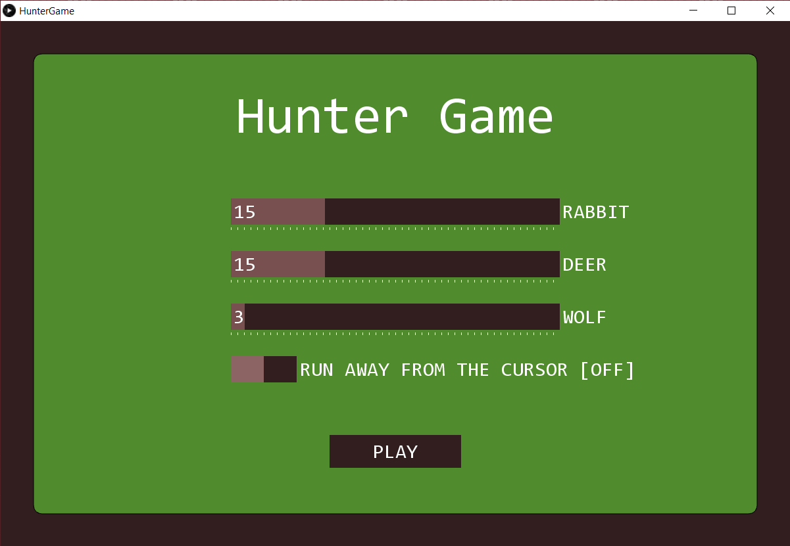

# Steering behaviours [Hunter]
[Практична робота №3](https://github.com/introduction-to-gamedev/assignments/blob/master/2021/assignment_3.md) 

### Team Mike:
* Клюба Максим Андрійович;
* Малий Богдан-Іван Романович;
* Фолькін Дмитро Олегович;

### Опис
Дана гра була розроблена на [Processing](https://processing.org/) (використовує спрощений варіант Java).  
Для роботи вимагає, щоб на ПК був встановлений [JDK 8](https://java.com/en/download/).

Гравець керує мисливцем, який може рухатись в усі сторони (стрілочками або WASD) та стріляти на певну відстань за допомогою мишки. 
Після попадання у здобич, вона гине. Кількість патронів у мисливця обмежена (100 штук). Мета гри - залишитися єдиною особою на полі.

Меню гри, де можна налаштувати кількість особин різних тварин:

Нижче наведено ігровий процес.  
- **Мисливець** зображений найбільшим зеленим кругом;
- **Кролики** - це світло-сірі круги найменшого розміру; 
- **Лані** наведені світло-коричневими кругами середнього розміру;
- **Вовки** зображені як великі темно-сірі круги.

Якщо мисливець гине, то настає кінець гри, а якщо виживає і залишається єдиною особою на полі, то перемагає:  

